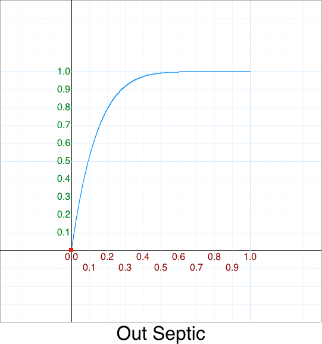
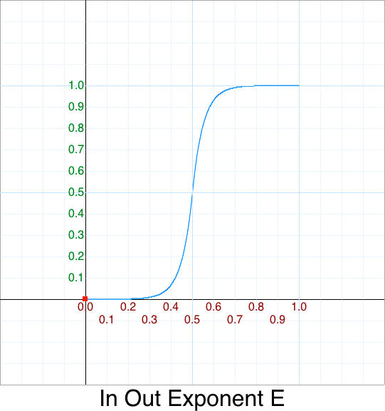

# Code Poetry: Easing Tutorial & Optimizations

# Table of Contents

* [Demos](https://github.com/Michaelangel007/easing#demos-html--javascript)
* [Overview](https://github.com/Michaelangel007/easing#overview)
 * [Easing Cheat Sheet](https://github.com/Michaelangel007/easing#easing-cheet-sheet)
 * [Comparision of easing functions](https://github.com/Michaelangel007/easing#comparision-of-easing-functions)
* [TL:DR; _"Shut up and show me the code!"_](https://github.com/Michaelangel007/easing#tldr-shut-up-and-show-me-the-code)
* [Easing ... what is it and why is it important?](https://github.com/Michaelangel007/easing#easing--what-is-it-and-why-is-it-important)
  * [Parameter `t` or `p`](https://github.com/Michaelangel007/easing#parameter-t-or-p)
  * [Simultaneous Animations](https://github.com/Michaelangel007/easing#simultaneous-animations)
  * [Why Javascript?](https://github.com/Michaelangel007/easing#why-javascript)
  * [The Color Axis](https://github.com/Michaelangel007/easing#the-color-axis)
  * [Linear Interpolation: Lerp](https://github.com/Michaelangel007/easing#linear-interpolation-lerp)
  * [Non-Linear Interpolation: Slerp](https://github.com/Michaelangel007/easing#non-linear-interpolation-slerp)
* [De Facto Easing Functions](https://github.com/Michaelangel007/easing#de-facto-easing-functions)
* [Easing Cleanup](https://github.com/Michaelangel007/easing#easing-cleanup)
 * [Cleanup - Linear](https://github.com/Michaelangel007/easing#cleanup---linear)
 * [I'm here for an argument](https://github.com/Michaelangel007/easing#im-here-for-an-argument)
 * [Warp Speed Mr. Sulu](https://github.com/Michaelangel007/easing#warp-speed-mr-sulu)
 * [What's with this "In, Out, In-Out" business, anyways?](https://github.com/Michaelangel007/easing#whats-with-this-in-out-in-out-business-anyways)
   * [Out   ](https://github.com/Michaelangel007/easing#out)
   * [In-Out](https://github.com/Michaelangel007/easing#in-out)
* [Cleanup - In](https://github.com/Michaelangel007/easing#in)
 * [Cleanup - In Back](https://github.com/Michaelangel007/easing#cleanup---in-back)
 * [Cleanup - In Bounce](https://github.com/Michaelangel007/easing#cleanup---in-bounce)
 * [Cleanup - In Circle](https://github.com/Michaelangel007/easing#cleanup---in-circle)
 * [Cleanup - In Cubic](https://github.com/Michaelangel007/easing#cleanup---in-cubic)
 * [Cleanup - In Elastic](https://github.com/Michaelangel007/easing#cleanup---in-elastic)
 * [Cleanup - In Exponent 2](https://github.com/Michaelangel007/easing#cleanup---in-exponent-2)
 * [Cleanup - In Exponent e](https://github.com/Michaelangel007/easing#cleanup---in-exponent-e)
 * [Cleanup - In Log10](https://github.com/Michaelangel007/easing#cleanup---in-log10)
 * [Cleanup - In Octic](https://github.com/Michaelangel007/easing#cleanup---in-octic)
 * [Cleanup - In Quadratic](https://github.com/Michaelangel007/easing#cleanup---in-quadratic)
 * [Cleanup - In Quartic](https://github.com/Michaelangel007/easing#cleanup---in-quartic)
 * [Cleanup - In Quintic](https://github.com/Michaelangel007/easing#cleanup---in-quintic)
 * [Cleanup - In Septic](https://github.com/Michaelangel007/easing#cleanup---in-sextic)
 * [Cleanup - In Sextic](https://github.com/Michaelangel007/easing#cleanup---in-septic)
 * [Cleanup - In Sine](https://github.com/Michaelangel007/easing#cleanup---in-sine)
* [Cleanup Out](https://github.com/Michaelangel007/easing#cleanup---out)
 * [Cleanup - Out Back](https://github.com/Michaelangel007/easing#cleanup---out-back)
 * [Cleanup - Out Bounce](https://github.com/Michaelangel007/easing#cleanup---out-bounce)
 * [Cleanup - Out Circle](https://github.com/Michaelangel007/easing#cleanup---out-circle)
 * [Cleanup - Out Cubic](https://github.com/Michaelangel007/easing#cleanup---out-cubic)
 * [Cleanup - Out Elastic](https://github.com/Michaelangel007/easing#cleanup---out-elastic)
 * [Cleanup - Out Exponent 2](https://github.com/Michaelangel007/easing#cleanup---out-exponent-2)
 * [Cleanup - Out Exponent e](https://github.com/Michaelangel007/easing#cleanup---out-exponent-e)
 * [Cleanup - Out Log10](https://github.com/Michaelangel007/easing#cleanup---out-log10)
 * [Cleanup - Out Octic](https://github.com/Michaelangel007/easing#cleanup---out-octic)
 * [Cleanup - Out Quadratic](https://github.com/Michaelangel007/easing#cleanup---out-quadratic)
 * [Cleanup - Out Quartic](https://github.com/Michaelangel007/easing#cleanup---out-quartic)
 * [Cleanup - Out Quintic](https://github.com/Michaelangel007/easing#cleanup---out-quintic)
 * [Cleanup - Out Septic](https://github.com/Michaelangel007/easing#cleanup---out-sextic)
 * [Cleanup - Out Sextic](https://github.com/Michaelangel007/easing#cleanup---out-septic)
 * [Cleanup - Out Sine](https://github.com/Michaelangel007/easing#cleanup---out-sine)
* [Cleanup In Out](https://github.com/Michaelangel007/easing#cleanup-in-out)
 * [Cleanup - In Out Back](https://github.com/Michaelangel007/easing#cleanup---in-out-back)
 * [Cleanup - In Out Bounce](https://github.com/Michaelangel007/easing#cleanup---in-out-bounce)
 * [Cleanup - In Out Circle](https://github.com/Michaelangel007/easing#cleanup---in-out-circle)
 * [Cleanup - In Out Cubic](https://github.com/Michaelangel007/easing#cleanup---in-out-cubic)
 * [Cleanup - In Out Elastic](https://github.com/Michaelangel007/easing#cleanup---in-out-elastic)
 * [Cleanup - In Out Exponent 2](https://github.com/Michaelangel007/easing#cleanup---in-out-exponent-2)
 * [Cleanup - In Out Exponent e](https://github.com/Michaelangel007/easing#cleanup---in-out-exponent-e)
 * [Cleanup - In Out Log10](https://github.com/Michaelangel007/easing#cleanup---in-out-log10)
 * [Cleanup - In Out Octic](https://github.com/Michaelangel007/easing#cleanup---in-out-octic)
 * [Cleanup - In Out Quadratic](https://github.com/Michaelangel007/easing#cleanup---in-out-quadratic)
 * [Cleanup - In Out Quartic](https://github.com/Michaelangel007/easing#cleanup---in-out-quartic)
 * [Cleanup - In Out Quintic](https://github.com/Michaelangel007/easing#cleanup---in-out-quintic)
 * [Cleanup - In Out Septic](https://github.com/Michaelangel007/easing#cleanup---in-out-sextic)
 * [Cleanup - In Out Sextic](https://github.com/Michaelangel007/easing#cleanup---in-out-septic)
 * [Cleanup - In Out Sine](https://github.com/Michaelangel007/easing#cleanup---in-out-sine)
* [Verification](https://github.com/Michaelangel007/easing#verification)
* [Miscellaneous](https://github.com/Michaelangel007/easing#miscellaneous)
 * [jQuery UI](https://github.com/Michaelangel007/easing#jquery-ui)
* [TODO](https://github.com/Michaelangel007/easing#todo)


## Demos (HTML + Javascript)

* [Compare Demo](https://htmlpreview.github.io/?https://github.com/Michaelangel007/easing/blob/master/compare.html)
* [Graph   Demo](https://htmlpreview.github.io/?https://github.com/Michaelangel007/easing/blob/master/graph.html)


## Overview

This a tutorial in how to:

* understand easing functions,
* how to implement them,
* how to optimize them, and
* how to write the beautiful code behind them


## Easing Cheet Sheet


There is also a high resolution [4861x4000 Cheat Sheet](pics/easing_cheat_sheet.png)


## Comparision of easing functions

* Start of animation


* Middle of animation


* End of animation


# TL:DR; _"Shut up and show me the code!"_

**`Easing` is a function that "warps time".**

```Javascript
// Optimized Easing Functions by Michael "Code Poet" Pohoreski, aka _Michaelangel007_
// https://github.com/Michaelangel007/easing
// License: Free as in speech and beer; Attribution is always appreciated!
// Note: Please keep the URL so people can refer back to how these were derived.
var EasingFuncs = // Array of Functions
[
// Power -- grouped by In,Out,InOut
    function None           (p) { return 1;               }, // p^0 Placeholder for no active animation
    function Linear         (p) { return p;               }, // p^1 Note: In = Out = InOut
    function InQuadratic    (p) { return p*p;             }, // p^2 = Math.pow(p,2)
    function InCubic        (p) { return p*p*p;           }, // p^3 = Math.pow(p,3)
    function InQuartic      (p) { return p*p*p*p;         }, // p^4 = Math.pow(p,4)
    function InQuintic      (p) { return p*p*p*p*p;       }, // p^5 = Math.pow(p,5)
    function InSextic       (p) { return p*p*p*p*p*p;     }, // p^6 = Math.pow(p,6)
    function InSeptic       (p) { return p*p*p*p*p*p*p;   }, // p^7 = Math.pow(p,7)
    function InOctic        (p) { return p*p*p*p*p*p*p*p; }, // p^8 = Math.pow(p,8)

    function OutQuadratic   (p) { var m=p-1; return 1-m*m;             },
    function OutCubic       (p) { var m=p-1; return 1+m*m*m;           },
    function OutQuartic     (p) { var m=p-1; return 1-m*m*m*m;         },
    function OutQuintic     (p) { var m=p-1; return 1+m*m*m*m*m;       },
    function OutSextic      (p) { var m=p-1; return 1-m*m*m*m*m*m;     },
    function OutSeptic      (p) { var m=p-1; return 1+m*m*m*m*m*m*m;   },
    function OutOctic       (p) { var m=p-1; return 1-m*m*m*m*m*m*m*m; },

    function InOutQuadratic (p) { var m=p-1,t=p*2; if (t < 1) return p*t;             return 1-m*m            *  2; },
    function InOutCubic     (p) { var m=p-1,t=p*2; if (t < 1) return p*t*t;           return 1+m*m*m          *  4; },
    function InOutQuartic   (p) { var m=p-1,t=p*2; if (t < 1) return p*t*t*t;         return 1-m*m*m*m        *  8; },
    function InOutQuintic   (p) { var m=p-1,t=p*2; if (t < 1) return p*t*t*t*t;       return 1+m*m*m*m*m      * 16; },
    function InOutSextic    (p) { var m=p-1,t=p*2; if (t < 1) return p*t*t*t*t*t;     return 1-m*m*m*m*m*m    * 32; },
    function InOutSeptic    (p) { var m=p-1,t=p*2; if (t < 1) return p*t*t*t*t*t*t;   return 1+m*m*m*m*m*m*m  * 64; },
    function InOutOctic     (p) { var m=p-1,t=p*2; if (t < 1) return p*t*t*t*t*t*t*t; return 1-m*m*m*m*m*m*m*m*128; },

// Standard -- grouped by Type
    function InBack         (p) { var              k = 1.70158        ;              return p*p*(p*(k+1) - k);                                        },
    function InOutBack      (p) { var m=p-1,t=p*2, k = 1.70158 * 1.525; if (p < 0.5) return p*t*(t*(k+1) - k); else return 1 + 2*m*m*(2*m*(k+1) + k); }, // NOTE: Can go negative! i.e. p = 0.008
    function OutBack        (p) { var m=p-1,       k = 1.70158        ;                                             return 1 +   m*m*(  m*(k+1) + k); },

    function InBounce       (p) { return 1 - EasingFuncs[ Easing.OUT_BOUNCE ]( 1-p ); },
    function InOutBounce    (p) {
                                    var t = p*2;
                                    if (t < 1) return 0.5 - 0.5*EasingFuncs[ Easing.OUT_BOUNCE ]( 1 - t );
                                    return            0.5 + 0.5*EasingFuncs[ Easing.OUT_BOUNCE ]( t - 1 );
                                },
    function OutBounce      (p) {
                                    var r  = 1  / 2.75; // reciprocal
                                    var k1 =         r; // 36.36%
                                    var k2 = 2     * r; // 72.72%
                                    var k3 = 1.5   * r; // 54.54%
                                    var k4 = 2.5   * r; // 90.90%
                                    var k5 = 2.25  * r; // 81.81%
                                    var k6 = 2.625 * r; // 95.45%
                                    var k0 = 7.5625, t;

                                    /**/ if (p < k1) {             return k0 * p*p;            }
                                    else if (p < k2) { t = p - k3; return k0 * t*t + 0.75;     } // 48/64
                                    else if (p < k4) { t = p - k5; return k0 * t*t + 0.9375;   } // 60/64
                                    else             { t = p - k6; return k0 * t*t + 0.984375; } // 63/64
                                },

    function InCircle       (p) {                             return  1-Math.sqrt( 1 - p*p );                                                      },
    function InOutCircle    (p) { var m=p-1,t=p*2; if (t < 1) return (1-Math.sqrt( 1 - t*t ))*0.5; else return (Math.sqrt( 1 - 4*m*m ) + 1) * 0.5; },
    function OutCircle      (p) { var m=p-1      ;                                                      return  Math.sqrt( 1 -   m*m );            },

    function InElastic      (p) { var m = p-1; return  - Math.pow( 2,10*m  ) * Math.sin( ( m*40 - 3) * Math.PI/6  ); },
    function InOutElastic   (p) {
                                    var s = 2*p-1;                 // remap: [0,0.5] -> [-1,0]
                                    var k = (80*s-9) * Math.PI/18; // and    [0.5,1] -> [0,+1]

                                    if (s < 0) return   -0.5*Math.pow(2, 10*s) * Math.sin( k );
                                    else       return 1 +0.5*Math.pow(2,-10*s) * Math.sin( k );
                                },
    function OutElastic     (p) {              return 1+(Math.pow( 2,10*-p ) * Math.sin( (-p*40 - 3) * Math.PI/6 )); },

    // NOTE: 'Exponent2' needs clamping for 0 and 1 respectively
    function InExponent2    (p) {   if (p <= 0) return 0; return   Math.pow( 2,  10*(p-1) ); },
    function InOutExponent2 (p) {
                                    if (p <= 0) return 0;
                                    if (p >= 1) return 1;
                                    if (p <0.5) return             Math.pow( 2,  10*(2*p-1)-1);
                                    else        return           1-Math.pow( 2, -10*(2*p-1)-1);
                                },
    function OutExponent2   (p)  {   if (p >= 1) return 1; return 1-Math.pow( 2, -10* p    ); },


    function InSine         (p) { return      1 - Math.cos( p * Math.PI*0.5 );  },
    function InOutSine      (p) { return 0.5*(1 - Math.cos( p * Math.PI     )); },
    function OutSine        (p) { return          Math.sin( p * Math.PI*0.5 );  },

// Non-Standard
    function InExponentE    (p) {   if (p <= 0) return 0; return   Math.pow( Math.E, -10*(1-p) ); }, // Scale 0..1 -> p^-10 .. p^0
    function InOutExponentE (p) {
                                    var t = p*2;
                                    if (t < 1) return 0.5 - 0.5*EasingFuncs[ Easing.OUT_EXPONENTE ]( 1 - t );
                                    return            0.5 + 0.5*EasingFuncs[ Easing.OUT_EXPONENTE ]( t - 1 );
                                },
    function OutExponentE   (p) { return 1 - EasingFuncs[ Easing.IN_EXPONENTE ]( 1-p ); },


    function InLog10        (p) { return 1 - EasingFuncs[ Easing.OUT_LOG10 ]( 1-p ); },
    function InOutLog10     (p) {
                                    var t = p*2;
                                    if (t < 1) return 0.5 - 0.5*EasingFuncs[ Easing.OUT_LOG10      ]( 1 - t );
                                    return            0.5 + 0.5*EasingFuncs[ Easing.OUT_LOG10      ]( t - 1 );
                                },
    function OutLog10       (p) { return Math.log10( (p*9)+1 ); }, // Scale 0..1 -> Log10( 1 ) .. Log10( 10 )

    function InSquareRoot   (p) { return 1 - EasingFuncs[ Easing.OUT_SQRT       ]( 1-p ); },
    function InOutSquareRoot(p) {
                                    var t = p*2;
                                    if (t < 1) return 0.5 - 0.5*EasingFuncs[ Easing.OUT_SQRT       ]( 1 - t );
                                    return            0.5 + 0.5*EasingFuncs[ Easing.OUT_SQRT       ]( t - 1 );
                                },
    function OutSquareRoot  (p) { return Math.sqrt( p ) },
];
```

But we're getting ahead of ourselves ...


# Easing ... what is it and why is it important?

In UI (User Interface) design, or CG (Computer Graphics) rendering, often times
we want to animate some "thing" over time. For eample:

* fade out an object (e.g. transistion alpha from 1.0 to 0.0),
* interpolate its location so it "slides offscreen" (e.g. change x (or y) over time), or
* the "reverse" animation of one of the above

Before we can do that we first need to know four things ..

* The `start` value
* The `end`   value
* The `duration` of the animation
* The current `elapsed` time

... then we can calculate the current value. Once we have all the variables we
can use this equation:

```Javascript
    current = start + (end-start)*(elapsed/duration);
```

The _units_ of the initial `start` and final `end` values can be anything we wish
as long as they all have the same consistent units. We could be animating something
in _px_ (pixels), over _m/s_ (meters/second), etc. It doesn't matter.

Likewise the `duration` and `elapsed` time could be in seconds, or milliseconds,
etc., as long as we are again consistent and use the same units.  Our
calculations would be incorrect if we mixed the units -- say `duration` was in
seconds and `elapsed` in milliseconds.  Hey, even _rocket scientists_ sometimes
have trouble with this concept in practice -- don't pull a NASA. :-)

For example, a designer wants us to animate an dialog panel from 30 pixels to 40 pixels
over 10 seconds. We draw the screen at 60 times a second.  What would be the current
value (i.e. position) after 2 seconds?

Yes, this is a trivial example, but bear with me.

Our _knowns_:

    start     = 30 px
    end       = 40 px
    elapsed   =  2 seconds
    duration  = 10 seconds
    framerate = 60 Hz

**Note:** The framerate was _extraneous_ information. It never hurts to
_categorize_ ALL the information. We can always discard, or ignore,
information that isn't pertinent to the problem.

Anyways, solving for the unknown _current_ `position`:

```Javascript
    position = start + (elapsed/duration)*(end-start);
    position = 30 + (2/10)*(40-30)
    position = 30 + (0.2*10)
    position = 30 + 2
    position = 32 px
```

If you don't have an intuitive feel for what easing is then maybe this alternative
**analogy** might help.  Mathematically, easing is the _same concept as
calculating distance_ from Physics:

For example, when we have constant, linear motion we use the formula:

```Javascript
    Velocity = Distance/Time
```

And, solving for `distance`:

```Javascript
    Distance = Velocity*Time
```

Digressing slightly, in Physics `Time`, really is the `Elapsed` time, starting from zero.
We'll avoid sloppy ambigious terms like `Time` to minimize confusion.

Getting back on-topic. Note, that this is _relative_ distance.

If we have an **absolute** start and end position the formula becomes:

```Javascript
    Position = Start + (End-Start)*(Elapsed/Duration)
```

Where did this formula come from?

We can replace `Velocity` with `(Distance/Time)` and re-solving for this new equation:

```Javascript
    Distance = Velocity*Time

    Position = Start + Velocity*Elapsed
    Position = Start + (Difference/Durationo)*Elapsed
    Position = Start + (End-Start)*Elapsed
```

Notice how if `start` is zero the formula becomes the common:

```Javascript
    Position = 0 + (End-0)*(Elapsed/Duration)
    Position = End*(Elapsed/Duration)
    Distance = (End/Duration)*Elapsed
    Distance = Velocity*Elapsed
    Distance = Velocity*Time
```

Now as programmers we love to invent our own terminology.

However, instead of a "hard-coded" formula we:

1. we call animation the name _"easing"_, and
2. parameterize it.

What the heck is _Parameterization_ ?

_Parameterization_ is just a fancy word for abstraction or _generalizing_.
Instead of using a hard-coded fixed function we instead use a
generic or custom function. We'll discuss this more later.

Remember, our easing _formula_ looks like:

```Javascript
    position = start + (end - start)*(elapsed/duration);
```

As a _function_, it might look like:

```Javascript
    Easing: function( ... )
    {
        var position = ...;
        return position;
    }
```

With parameterization, it might look like:

```Javascript
    Easing: function( type, ... )
    {
        var position;

        switch( type )
        {
            case ?: position = ...; break;
            case ?: position = ...; break;
        }

        return position;
    }
```

But before we can calculate the final position we need the relevent information:

```Javascript
    position = Easing( type, elapsed/duration, start, end )
```

We'll get to easing `types` shortly but first we need to talk about time.


## Parameter `t` or `p`

That `elapsed / duration` term is kind of clunky.

For _convenience_ we _normalize_ time to be a **normalized percentage**
of the elapsed time.  Now that is a bit of a mouthful, so let's break it down
into simpler terms:

 * _Percentage_ means between 0% and 100%,
 * _Normalized_ in this context means between 0.0 and 1.0. Mathematically the range is
 [0,1], that is, between 0.0 (inclusive) and 1.0 (inclusive).
 See my StackOverflow answer about [What does the square bracket and parenthesis mean?](http://stackoverflow.com/a/37171635/1339447)

Since `normalized percentage` is so common and unweidly most people just use the
shorted `normalized` phrase to mean this value is inbetween 0.0 and 1.0.

If you are familiar with OpenGL or DirectX graphic API's,
when a vertex is tranformed through the pipleine you will run across something
called _"Normalized Device Coordinates"_ which embody the same idea.

If we wanted to place an object at the middle of the screen we could place
its center point at:

 * `<screen width/2, screen height/2, 0.0>` (in pixels),

OR, in normalized coordinates:

 * `<0.5, 0.5>` -- basically half the width, and half the height.

Getting back to our normalized time value `p` ...

```Javascript
    p = elapsed / duration.
```

What does this mean?  Visually when `p` is:

| p  | Animation ... |
|:---|:--------------|
| 0.0| ... has not yet started -- the object is still at its initial value |
| 0.5| ... is half way done |
| 1.0| ... is complete -- the object has reached its final value |


**Note**: Often you'll see the paramater name `t` in formulas.  I'll avoid it since
it can be confused with `time` which _may_ or _may not_ be normalized.  UGH.

Instead, I'll use the variable `p` as a visual mnemonic that we are representing
a normalized percentage time, that is, `elapsed/duration`.


## Simultaneous Animations

There is no reason why we couldn't even have multiple simulataneous animations
on the _same_ object all going on at once!  Typically objects have more then
one dimension, such as eight dimensions (8D).

_Eight dimensions!?_

Whoa! Where did all those come from? When did this turn into String Theory? :-)

Relax, we're not talking about the esoteric nature of reality,
only simulating some of the useful bits, pardon the pun.

For example we could have:

* an object starts faded out (alpha = 0.0),
* is offscreen (start x = -width of object),
* starts small (start width & height = 1 px)
* slides in to the center of the screen (final x = screen width/2), and
* becomes opaque (alpha = 1.0)
* grows to half size (end width = screen width/2 px, end height = screen height/2 px)

These animation or easing `axis` are all **independent.**  We could represent
these axis in Javascript as:

```Javascript
var Axis =
{
    X   : 0, // left position    (in pixels)
    Y   : 1, // top  position    (in pixels)
    W   : 2, // width  dimension (in pixels)
    H   : 3, // height dimension (in pixels)
    R   : 4, // normalized red   color
    G   : 5, // normalized green color
    B   : 6, // normalized blue  color
    A   : 7, // normalized alpha color
    NUM : 8,
};
```


## Why Javascript?

_Javascript_ (JS) is a crappy (*) language designed in 10 days. If it is so bad then why use it?

Two reasons:

* Every modern computer has a web browser which means there is _nothing to install,_ and
* More importantly, _to show that is possible_ to write **good** code in any language,
even as one as bad as Javascript.

(*) What precisely makes Javascript so garbage you ask?

* It is BASIC all over again -- accidently misspell a variable and JS uses the `undefined` value _without any warnings_ ...
* ... unless you use the **hack** `"use strict";` at the top of every Javascript program
* No ability to include other code -- unless you use `require` hack which **only** works in _server_ and not in _a browser_
* ASI, aka Automatic Semi-Colon Insertion.  You can't put a return on a line by itself due to the idiotic grammar/parsing.  Douglas Crockford [said it best @3:41](https://www.youtube.com/watch?v=hQVTIJBZook#t=1906) _"Why am I betting my career on this piece of crap?"_
* No native unsigned 64-bit int. `var n = (1 << 63); console.log( n ); // -2147483648` // **facepalm**
* Every number is a 64-bit floating-point, unless you use [Float32Array](https://developer.mozilla.org/en-US/docs/Web/JavaScript/Reference/Global_Objects/Float32Array)
* The comparision operator `==` is [horribly broken](https://dorey.github.io/JavaScript-Equality-Table/) i.e. `if( 0 == "0" ) console.log( "equal" ); // equal!?`
* Its type system is foobar. See Gary Bernhardt's [WAT talk](https://www.destroyallsoftware.com/talks/wat) for how brain-dead the language is.
* No automatic _multiline string_ concatenation. This means you need to do stupid shit like this _at run-time!_

```Javascript
 var text = ''
          +'First line\n'
          + 'Second line\n'
          + 'Third line\n'
          ;
```

instead of C's automatic multiline string concatenation:

```C
   char *text =
"First line\n"
"Second line\n"
"Third line\n"
        ;
```

or [Python's way](http://stackoverflow.com/questions/10660435/pythonic-way-to-create-a-long-multi-line-string):

```Python
    s = """ First Line
            Second line
            Third line """
```

Of course you have to deal with Python's idiotic indentation shenanigans but that is a discussion for another day.


OK, enough ranting. Let's get back to our axis of evil, er, 8D axis ...


## The Color Axis

The astute reader will notice I snuck color in there!

i.e. What if we wanted
to fade an object from Black to Yellow and back to Black again, say for a glowing
highlight? By separting the hue into separate axis such as red, green, and blue,
our animation engine could support this very easily.

Why seperate the axis?

We may be given two colors in a hex string format, `#RRGGBB`,
and want to interpolate between them. Before we can do this we would need to

 * Break this down into the 3 components, or Red, Green, Blue axis, respectively.
 * Then we need to scale the triad (between 0 and 255), and
 * Combine them to form a valid `#RRGGBB` hex string.
 * Lastly, then when we need to apply the color to the HTML element.

For example this function will do exactly the middle part.

```Javascript
// Convert numeric r,g,b values to a HTML color hex string `#RRGGBB`
function RGBtoHex = function( r, g, b )
{
    return '#'
        + ('0' + ((255 * r) | 0).toString( 16 )).slice( -2 )
        + ('0' + ((255 * g) | 0).toString( 16 )).slice( -2 )
        + ('0' + ((255 * b) | 0).toString( 16 )).slice( -2 )
};
```

Sometimes you'll see the terminology of a `controller`.

i.e. If wanted to animate across the rainbow
from Red,Orange,Yellow,Green,Cyan,Azure,Blue,Violet,Magenta
it might be more convenient to use a `hue` controller.

At the high level it would be:

```Javascript
    /** Animate between two colors
     *  @param {Number} startAngle - starting color in degrees
     *  @param {Number} endAngle   - end      color in degrees
     *  @param {Number} duration   - duration in seconds
     */
    function HueControllerAnimate( startAngle, endAngle, duration )
    {
        // Animate an angle from startAngle to endAngle over a duration
        // On each update
        //    convert hue to r,g,b
        //    apply it to the object
    }
```

This would in turn _drive_ the animation values red, green, blue over time.

The reason I bring up color is that if you start interpolating color you may
need to look into PMA (Premultiplied alpha) -- where you need to multiply `alpha`
**into** the red, green, and blue channels.

See Tom Forsyth's
[Blog](http://eelpi.gotdns.org/blog.wiki.html) for these 2 articles:

* Premultiplied alpha, 18 March 2015 (created 15 July 2006)
* Premultiplied alpha part 2, 18 March 2015 (created 18 March 2015)

But I digress.


## Linear Interpolation: Lerp

In _computer graphics_ terminology this calculating "inbetween" values is
called `interpolation`. In _animation_ it is called `tweening`.

Given different times, we want these values:

| p   | Value           |
|:----|:----------------|
| 0.0 | start           |
| 0.5 | 0.5*(end-start) |
| 1.0 | end             |

What we have just discussed is the simplist type of interpolation:
a `linear` interpolation.


The graph looks like this:


Since this type of interpolation is so common it has its own abbreviation: `Lerp`

* "Lerp" - [linear interpolation](https://en.wikipedia.org/wiki/Linear_interpolation).

_Lerp_ is typically shown in one of two common forms:

```Javascript
    function lerp( t, a, b )
    {
        return a + (t-1)(b-a);
    }
```

or

```Javascript
    function lerp( t, a, b )
    {
        return (1-t)*a + t*b;
    }
```

This is one of those times where `t` is commonly used.

Let's replace those abbreviations with descriptive names for now since we
want to understand what they mean.

```Javascript
    function lerp( p, start, end )
    {
        return start + (p-1)(end-start);
    }

    function lerp( p, start, end )
    {
        return (1-p)*start + p*end;
    }
```

**Note**: Some programmers factor out `(end-start)` and call it `c` for
_change_ or `d` for _delta_ but with the latter `d` could also mean
_duration_ so be aware of different conventions used by people.

Mathematically, the two lerp equations are equivalent but since computers are
finite they have precision errors which can and do creep in.  You should be
familiar with both forms as you'll see them in common usage.

The first one _in practice_ may not be as accurate as the latter due to
floating-point error accumulation.  Why would it be used then?  The first form
is popular due to modern hardware often having a native _FMA_
[Fused Multiply-Add](https://en.wikipedia.org/wiki/Multiply%E2%80%93accumulate_operation)
hardware instruction. Thus sometimes you'll see the second form to maximize
precision and minimize error, at the cost of slightly slower performance.

This is a common trade-off in computing -- you can have speed or accuracy, pick one. :-/

## Non-linear interpolation: slerp

If one interpolates between two quaternions they will come across the term `slerp`.

This is just an abbreviation for _spherical interpolation_.

Quaternions won't be discussed here, but it is also nice to be aware of the broader terminology in related fields.


# De Facto Easing Functions

Back in 2001 Robert Penner provided the original, "canonical" _de facto_ easing functions written in ActionScript.
They became extremely popular.

First, let's tabulate the arguments they use:

**Legend:**

|Symbol|Meaning       |Notes                                                  |
|:----:|:-------------|:------------------------------------------------------|
|  x   | not used     | Useless extra argument that just clutters up the code |
|  t   | elapsed time | Starting from zero                                    |
|  b   | begin val    |                                                       |
|  c   | change val   | end-begin                                             |
|  d   | duration     | **BUG:** generates NaN if zero!                       |

And without further ado:

```Javascript
// http://www.robertpenner.com/easing
// by Robert Penner Copyright 2001
// License: BSD -- http://robertpenner.com/easing_terms_of_use.html
var Original =
{
    easeInQuad: function (x, t, b, c, d) {
        return c*(t/=d)*t + b;
    },
    easeOutQuad: function (x, t, b, c, d) {
        return -c*(t/=d)*(t-2) + b;
    },
    easeInOutQuad: function (x, t, b, c, d) {
        if ((t/=d/2) < 1) return c/2*t*t + b;
        return -c/2 * ((--t)*(t-2) - 1) + b;
    },
    easeInCubic: function (x, t, b, c, d) {
        return c*(t/=d)*t*t + b;
    },
    easeOutCubic: function (x, t, b, c, d) {
        return c*((t=t/d-1)*t*t + 1) + b;
    },
    easeInOutCubic: function (x, t, b, c, d) {
        if ((t/=d/2) < 1) return c/2*t*t*t + b;
        return c/2*((t-=2)*t*t + 2) + b;
    },
    easeInQuart: function (x, t, b, c, d) {
        return c*(t/=d)*t*t*t + b;
    },
    easeOutQuart: function (x, t, b, c, d) {
        return -c * ((t=t/d-1)*t*t*t - 1) + b;
    },
    easeInOutQuart: function (x, t, b, c, d) {
        if ((t/=d/2) < 1) return c/2*t*t*t*t + b;
        return -c/2 * ((t-=2)*t*t*t - 2) + b;
    },
    easeInQuint: function (x, t, b, c, d) {
        return c*(t/=d)*t*t*t*t + b;
    },
    easeOutQuint: function (x, t, b, c, d) {
        return c*((t=t/d-1)*t*t*t*t + 1) + b;
    },
    easeInOutQuint: function (x, t, b, c, d) {
        if ((t/=d/2) < 1) return c/2*t*t*t*t*t + b;
        return c/2*((t-=2)*t*t*t*t + 2) + b;
    },
    easeInSine: function (x, t, b, c, d) {
        return -c * Math.cos(t/d * (Math.PI/2)) + c + b;
    },
    easeOutSine: function (x, t, b, c, d) {
        return c * Math.sin(t/d * (Math.PI/2)) + b;
    },
    easeInOutSine: function (x, t, b, c, d) {
        return -c/2 * (Math.cos(Math.PI*t/d) - 1) + b;
    },
    easeInExpo: function (x, t, b, c, d) {
        return (t==0) ? b : c * Math.pow(2, 10 * (t/d - 1)) + b;
    },
    easeOutExpo: function (x, t, b, c, d) {
        return (t==d) ? b+c : c * (-Math.pow(2, -10 * t/d) + 1) + b;
    },
    easeInOutExpo: function (x, t, b, c, d) {
        if (t==0) return b;
        if (t==d) return b+c;
        if ((t/=d/2) < 1) return c/2 * Math.pow(2, 10 * (t - 1)) + b;
        return c/2 * (-Math.pow(2, -10 * --t) + 2) + b;
    },
    easeInCirc: function (x, t, b, c, d) {
        return -c * (Math.sqrt(1 - (t/=d)*t) - 1) + b;
    },
    easeOutCirc: function (x, t, b, c, d) {
        return c * Math.sqrt(1 - (t=t/d-1)*t) + b;
    },
    easeInOutCirc: function (x, t, b, c, d) {
        if ((t/=d/2) < 1) return -c/2 * (Math.sqrt(1 - t*t) - 1) + b;
        return c/2 * (Math.sqrt(1 - (t-=2)*t) + 1) + b;
    },
    easeInElastic: function (x, t, b, c, d) {
        var s=1.70158;var p=0;var a=c;
        if (t==0) return b;  if ((t/=d)==1) return b+c;  if (!p) p=d*.3;
        if (a < Math.abs(c)) { a=c; var s=p/4; }
        else var s = p/(2*Math.PI) * Math.asin (c/a);
        return -(a*Math.pow(2,10*(t-=1)) * Math.sin( (t*d-s)*(2*Math.PI)/p )) + b;
    },
    easeOutElastic: function (x, t, b, c, d) {
        var s=1.70158;var p=0;var a=c;
        if (t==0) return b;  if ((t/=d)==1) return b+c;  if (!p) p=d*.3;
        if (a < Math.abs(c)) { a=c; var s=p/4; }
        else var s = p/(2*Math.PI) * Math.asin (c/a);
        return a*Math.pow(2,-10*t) * Math.sin( (t*d-s)*(2*Math.PI)/p ) + c + b;
    },
    easeInOutElastic: function (x, t, b, c, d) {
        var s=1.70158;var p=0;var a=c;
        if (t==0) return b;  if ((t/=d/2)==2) return b+c;  if (!p) p=d*(.3*1.5);
        if (a < Math.abs(c)) { a=c; var s=p/4; }
        else var s = p/(2*Math.PI) * Math.asin (c/a);
        if (t < 1) return -.5*(a*Math.pow(2,10*(t-=1)) * Math.sin( (t*d-s)*(2*Math.PI)/p )) + b;
        return a*Math.pow(2,-10*(t-=1)) * Math.sin( (t*d-s)*(2*Math.PI)/p )*.5 + c + b;
    },
    easeInBack: function (x, t, b, c, d, s) {
        if (s == undefined) s = 1.70158;
        return c*(t/=d)*t*((s+1)*t - s) + b;
    },
    easeOutBack: function (x, t, b, c, d, s) {
        if (s == undefined) s = 1.70158;
        return c*((t=t/d-1)*t*((s+1)*t + s) + 1) + b;
    },
    easeInOutBack: function (x, t, b, c, d, s) {
        if (s == undefined) s = 1.70158;
        if ((t/=d/2) < 1) return c/2*(t*t*(((s*=(1.525))+1)*t - s)) + b;
        return c/2*((t-=2)*t*(((s*=(1.525))+1)*t + s) + 2) + b;
    },
    easeInBounce: function (x, t, b, c, d) {
        return c - Original.easeOutBounce (x, d-t, 0, c, d) + b;
    },
    easeOutBounce: function (x, t, b, c, d) {
        if ((t/=d) < (1/2.75)) {
            return c*(7.5625*t*t) + b;
        } else if (t < (2/2.75)) {
            return c*(7.5625*(t-=(1.5/2.75))*t + .75) + b;
        } else if (t < (2.5/2.75)) {
            return c*(7.5625*(t-=(2.25/2.75))*t + .9375) + b;
        } else {
            return c*(7.5625*(t-=(2.625/2.75))*t + .984375) + b;
        }
    },
    easeInOutBounce: function (x, t, b, c, d) {
        if (t < d/2) return Original.easeInBounce (x, t*2, 0, c, d) * .5 + b;
        return Original.easeOutBounce (x, t*2-d, 0, c, d) * .5 + c*.5 + b;
    }
};
```

Uhm, _yeah._ **NOT**.

Let's learn how to clean up this _fugly, overengineered code_ into the _beautiful_, exact equivalent mentioned at the beginning.

The astute reader will notice that `jQuery` initially adapted these _"as-is"_
before coming to their senses and cleaning them up into the _single argument version_ eventually.

* https://raw.githubusercontent.com/danro/jquery-easing/master/jquery.easing.js


# Easing Cleanup

There are numerous problems with the defacto 5-parameter easing functions.
This is **crap code** -- that's the technical term for _over-engineered._

Problems can be placed into two general categories:

* Meta
* Implementation

The _meta_ coding problems are:

 * Functions aren't alphabetized making searching/finding them non-intuitiave,
 * While _inter-easing_ functions are grouped together there is no seperator between _intra-easing_ such as whitespace.,
 * Names are abbreviated making them not obvious, such as `Expo` -- Exponent comes in multiple variations such as `Exponent_2` and `Exponent_e`,
 * Initially there seems to be a lot of easing functions, but they are incomplete -- they are missing some of the more common mathematical ones.

The _implementation_ problems are:

1. Buggy 1     - Generates NaN when d == 0
2. Buggy 2     - Doesn't handle edge cases when t<0 or t>d
3. Inefficient - t/d is always done to normalize the time; If there are multiple animations with the same duration then this causes extra processing. Also, you can often multiply by the reciprocal duration instead of doing a slow divide. When the animation is _started_ we "pre-calculate" `1/duration`.
4. Slow 1      - due to inefficient, redundant, or dead code
5. Slow 2      - b can be replaced with 0.0
6. Slow 3      - c can be replaced with 1.0
7. Wasteful    - argument x is declared in to all functions but never used

We will address and fix **all** of these bugs.


## Cleanup - Linear

First, let's start with the linear easing.

Hmm, there isn't one. Really?!  Let's add one for _completeness._

Its graph looks like this:


And in the original style the easing function would look like this:

```Javascript
    easeLinear: function (x, t, b, c, d) {
        return c*(t/=d) + b;
    },
```

Now, when `d` is 0, this generates a bug #1 `NaN`.  Let's digress slightly and
address bug #2, `t < 0` and `t > d` before we fix this.

```Javascript
    easeLinear: function (x, t, b, c, d) {
        if (t <= 0) return b    ; // start
        if (t >= d) return b + c; // end
        return c*(t/=d) + b;
```

What happens when `d` == 0 ? It returns the `end` for free!

```Javascript
    easeLinear: function (x, t, b, c, d) {
        if (t <= 0) return b    ;
        if (t >= d) return b + c; // t >= 0 return end
        return c*(t/=d) + b;
```

Let's make this a little more robust:

```Javascript
    easeLinear: function (x, t, b, c, d) {
        if (t <= 0) return b    ; // If d=0, then t is always t >= d
        if (t >= d) return b + c; // due to t < 0 already being handled
        var p = t/d;
        return c*p + b;
    },
```

Hmmm, some of these equations are starting to look familiar !

## "I'm here for an argument"

Without being pedantic with [Argument vs Parameter](http://stackoverflow.com/questions/1788923/parameter-vs-argument)
we still have a lot of parameters in our easing functions. Is there any way we can get rid of them?
Yes, with _reparameterization._

Reparameterization is just a fancy word for `re-mapping`.
Technically, it is [this](https://en.wikipedia.org/wiki/Parametrization).

There will be a test. :)

Since that Wikipedia page is so badly written and
will probably just confuse you more then it helps, the only take-away you need is this:

* _Reparameterization ... is the process of deciding and defining the parameters necessary for a ... specification._

A simple mnemonic to help remember it is: _re-parameter_

Basically, we want to re-map the range into something _convenient._
But that begs the question -- _what_ would be convenient?
Hmm, maybe a _range_ between 0.0 and 1.0 inclusive aka `normalized` values! :)

| b   | c       | Notes     |
|:---:|:--------|:----------|
| min | max-min | Old range |
| 0.0 | 1.0     | New range |

Notice now:

 * how the term `b` drops out
 * how the term `c` drops out
 * The entire formula becomes much simpler.

We'll do this for all the easing equations, converting them into a **single argument version**.

1. Since `x` is unused our function prototype becomes: `function( t, b, c, d )`
2. Since `b` is zero, our function prototype becomes: `function( t, c, d )`
3. Since `c` is one, our function prototype becomes: `function( t, d )`
4. Whoever _calls_ our easing function will be responsible for the `p = t/d` calculation so we can remove the last two terms and replace them with one.

Our function prototype then is the simple:

```Javascript
function Linear( p ) {
    return p;
}
```

We'll drop the `ease` prefix since

* These functions will be in a namespace anyways, and
* It provides a visual mnemonic to know which easing functions take 1 argument vs 5 arguments.


## "Warp Speed Mr. Sulu"

Now this linear easing form by itself isn't very interesting.

However, what if we _adjusted_ the time ? That is, when the animation is:

* 10% done, we pretend it is only  1% done,
* 20% done, we pretend it is only  4% done,
* 30% done, we pretend it is only  9% done,
* 40% done, we pretend it is only 16% done,
* 50% done, we pretend it is only 25% done,
* 60% done, we pretend it is only 36% done,
* 70% done, we pretend it is only 49% done,
* 80% done, we pretend it is only 64% done,
* 90% done, we pretend it is only 81% done,
*100% done, it really is 100% done.

Spot the pattern?

Using this legend:

* x = Percent 'normal' time
* y = Percent 'warped' time

| x   | y    |
|:----|:-----|
| 0.1 | 0.01 |
| 0.2 | 0.04 |
| 0.3 | 0.09 |
| 0.4 | 0.16 |
| 0.5 | 0.25 |
| 0.7 | 0.49 |
| 0.8 | 0.64 |
| 0.9 | 0.81 |
| 1.0 | 1.00 |

If we graph this pretend game we end up with this:


This is what is know as a `quadratic mapping.`

Mathematically the formula looks like this:

```Javascript
    y = x*x
```

Or in our parlance:

```Javascript
    function InQuadratic(p) { return p*p; }, // p^2 = Math.pow(p,2)
```

In one sense you could say that **`easing` is a function that "warps time".**
We can apply all sorts of "time warping" to produce many different interesting effects.

But first before we investigate and optimize them we need to go over `In`, `Out`, and `In Out`


## What's with this "In, Out, In-Out" business, anyways?

We introduced a new easing function which has the form: `quadratic`

```Javascript
    function InQuadratic(p) { return p*p; }, // p^2 = Math.pow(p,2)
```

And its graph:


For example, we could raise p to the standard powers:

|Power|Formula|Name       |
|----:|------:|:----------|
| 2   | p^2   | Quadratic |
| 3   | p^3   | Cubic     |
| 4   | p^4   | Quartic   |
| 5   | p^5   | Quintic   |
| 6   | p^6   | Sextic    |
| 7   | p^7   | Septic    |
| 8   | p^8   | Octic     |

Those graphs look like these:


We'll discuss other variations but first we need to discuss an important concept.


### Out

You may have noticed we snuck in the prefix `In` but didn't have one for Linear.

* InQuadratic
* InCubic
* InQuartic
* etc.

There are two reasons for that:

* Linear doesn't have them -- once you finish this section you'll understand why.
* If you assumed this implies there are more variations you would be correct!
There are many variations of mirrors, rotations, etc.

For now we're primarily interested in _flips_ -- of which there are 4 permutations:

1. We have already been discussin the case of _no flips_.

 

2. What happens when we flip the _output_ along the `y-axis`:

 ```Javascript
    function FlipY_Quadratic(p) { return 1 - InQuadratic( p ); }
 ```

 That has a graph that looks like this:

 


3. We could also flip the _input_ along the `x-axis`:

 ```Javascript
     function FlipX_Quadratic(p) { return InQuadratic( 1-p ); }
 ```

 That has a graph that looks like this:

 


4.  The most interesting ones are we _also_ flip along _both_ the `x-axis` and `y-axis`:

 ```Javascript
     function FlipY_FlipX_Quadratic(p) { return 1 - InQuadratic( 1-p ); }
 ```

 

 This _pattern_ of both x and y being flipped is _so common_ that it has its own name: **Out**

 ```Javascript
     function OutQuadratic(p) { return 1 - InQuadratic( 1-p ); }
 ```

 Now you may be thinking _"That doesn't even look like the one I saw at the very top!?"_

 i.e. To refresh your memory:

 ```Javascript
    function OutQuadratic (p) { var m=p-1; return 1-m*m; }
 ```

 Let's "semantically uncompress", adding line breaks and whitespace,  this so it is more readable:

 ```Javascript
    function OutQuadratic (p)
    {
        var m = p-1;

        return 1 - m*m;
    }
 ```

 Mathematically, the two are _exact_; the original function has just
been optimized so that the _general pattern_ of the power series
can be easier to spot

 I'll discuss in the `Clean Up - Out Quadratic` section, etc.

For recap we derived 4 quadratic easing functions:

```Javascript
    function      QuadraticIn      (p) { return        p *   p ; } // Red
    function FlipXQuadraticIn      (p) { return     (1-p)*(1-p); } // Green
    function FlipYQuadraticIn      (p) { return 1 -    p *   p ; } // Blue
    function FlipYFlipXQuadraticIn (p) { return 1 - (1-p)*(1-p); } // Orange "OutQuadratic"
```

If you want to play around with these, there is an excellent online (browser) graphing calculator:
[Desmos](https://www.desmos.com/calculator)


I've added color names to the above flip functions so you can what corresponds to what
since I'm not aware if you can name functions in Desmos.

This reminds me of the [Cubic Hermite spline](https://en.wikipedia.org/wiki/Cubic_Hermite_spline) -- specifically, the hermite basis functions.


I mentioned that there is `Out` variation for _Linear_.
By now it should be obvious that the FlipYFlipX doesn't change the graph.
Specifically,

* InLinear === OutLinear

Just in case you wondering.


### In-Out

In addition to flips, there is also another variation called
`InOut` where we "stitch" together both the `In` and `Out` into
one _continuous_ function.

This means we need to move 2 points:

* The end-point   of `In`  is <0.5,0.5>
* The start-point of `Out` is <0.5,0.5>

This requires 5 pre-requisites:

1. Scale the `In` height (`y`) by 1/2.

 ```Javascript
function InOutQuadratic_v1( p ) {
    return 0.5 * InQuadratic( p );
}
 ```

 or simply when inlined:

 ```Javascript
function InOutQuadratic_v1( p ) {
    return 0.5 * p*p;
}
 ```

 The graph looks like this:

 

2. Scale the `In` width (`x`) by 1/2.

 Reparameterization to the rescue!

 How? We can remap our original input `p` range and split it into _two_ ranges.
 I'll call the new input `t`:

| p range      | new t range  |
|:-------------|:-------------|
| [0.0 .. 0.5) | [0.0 .. 1.0] |
| [0.5 .. 1.0] | don't care   |

 And with a little bit of algebra it should be obvious of the scale factor:

 ```
    Input  : p = [0.0 .. 0.5)
    Output : t = [0.0 .. 1.0]
    Formula: t = 2*p
 ```

 ```Javascript
function InOutQuadratic_v2( p ) {
    var t = 2*p;
    return 0.5 * InQuadratic( t );
}
 ```

 or when inlined:

 ```Javascript
function InOutQuadratic_v2( p ) {
    return 0.5 * (2*p)*(2*p);
}
 ```

 Which simplifies down to:

 ```Javascript
function InOutQuadratic_v2( p ) {
    return 2 * (p*p);
}
 ```

 

 What we have done is move the end-point of `In` at <1,1> to <0.5, 0.5>.
 Since we are only keeping the bottom quarter
 we don't care about the right side of the graph
 as we'll replace that with the `Out` form.

 

3\. Similiarly for `In` we scale the `Out` height (`y`) by 1/2

 ```Javascript
 function InOutQuadratic_v3( p ) {
     return 0.5 * OutQuadratic( p );
 }
 ```

 or when inlined:

 ```Javascript
 function InOutQuadratic_v3( p ) {
     return 0.5 * (1 - ((1-p)*(1-p)));
 }
 ```

 The graph looks like this:

 

4\. Again, similiarly for `In` we scale the `Out` width (`x`) by 1/2

 Using reparameterization again we remap our original input `p` range and split it into _two_ ranges.
 Again, I'll call the new input `t`:

| p range      | new t range  |
|:-------------|:-------------|
| [0.0 .. 0.5) | don't care   |
| [0.5 .. 1.0] | [0.0 .. 1.0] |

 Solving for `t`:

 ```
    Input  : p = [0.5 .. 1.0]
    Output : t = [0.0 .. 1.0]
    Formula: t = 2*p-1
 ```

 Leaving:

```Javascript
function InOutQuadratic_v4( p ) {
    var t = 2*p - 1;
    return 0.5 * OutQuadratic( 2*p - 1 );
}
```

 

 We'll simplying this later in the [Cleanup - In Out Quadratic](https://github.com/Michaelangel007/easing#cleanup---in-out-quadratic) section.

 Again, we don't care about the left side since that is being
 replaced with `In`

 

5\. We need to move the <0,0> of `Out` to <0.5,0.5>

 That is a simply `y + 0.5`

```Javascript
function InOutQuadratic_v5( p ) {
    var t = 2*p - 1;
    return 0.5 + 0.5*OutQuadratic( 2*p - 1 );
}
```

 

And now we can piece together our `InOut` function.

First the `In`:

 ```Javascript
function InOutQuadratic_v2( p ) {
    var t = 2*p;
    return 0.5 * InQuadratic( t );
}
 ```

Plus the `Out`:

```Javascript
function InOutQuadratic_v5( p ) {
    var t = 2*p - 1;
    return 0.5 + 0.5*OutQuadratic( 2*p - 1 );
}
```

In Mathematics this is called a [piecewise function.](https://en.wikipedia.org/wiki/Piecewise)

It is written with the curly brace notation:

```
y =       0.5*InQudratic  ( 2*x     )   { 0  < x <= 1/2 }
y = 0.5 + 0.5*OutQuadratic( 2*x - 1 )   {1/2 < x <= 1   }
```

or alternatively:

```
    {        0.5*InQudratic  ( 2*x     ), if x <  1/2
y = {
    {  0.5 + 0.5*OutQuadratic( 2*x - 1 ), if x >= 1/2
```

We can factor out the common term `2*x` for readability:

 ```Javascript
function InOutQuadratic_v6( p )
{
    var t = 2*p;

    if( p < 0.5 ) return       0.5*InQuadratic ( 2*p     );
    else          return 0.5 + 0.5*OutQuadratic( 2*p - 1 );
}
 ```

 To save some typing we can remove that `0.5` and use `1` directly:

 ```Javascript
function InOutQuadratic_v6( p )
{
    var t = 2*p;

    if( t < 1 ) return       0.5*InQuadratic ( t     );
    else        return 0.5 + 0.5*OutQuadratic( t - 1 );
}
 ```

And now for the moment of truth:

 

TA-DA !

This matches our optimized version: :)

 

# Cleanup - In

With the fundamentals out of the way we can start optimizing
all the easing functions.

## Cleanup - In Back


## Cleanup - In Bounce


## Cleanup - In Circle


## Cleanup - In Cubic


## Cleanup - In Elastic


Recall the original:


```Javascript
    easeInElastic: function (x, t, b, c, d) {
        var s=1.70158;var p=0;var a=c;
        if (t==0) return b;  if ((t/=d)==1) return b+c;  if (!p) p=d*.3;
        if (a < Math.abs(c)) { a=c; var s=p/4; }
        else var s = p/(2*Math.PI) * Math.asin (c/a);
        return -(a*Math.pow(2,10*(t-=1)) * Math.sin( (t*d-s)*(2*Math.PI)/p )) + b;
    },
```

UGH.

Version 1 - Add line breaks

```Javascript
    easeInElastic: function (x, t, b, c, d) {
        var s=1.70158;
        var p=0;
        var a=c;

        if (t==0)
            return b;
        if ((t/=d)==1)
            return b+c;

        if (!p)
            p=d*.3;

        if (a < Math.abs(c)) {
            a=c;
            var s=p/4;
        }
        else
            var s = p/(2*Math.PI) * Math.asin (c/a);

        return -(a*Math.pow(2,10*(t-=1)) * Math.sin( (t*d-s)*(2*Math.PI)/p )) + b;
    },
```

Version 2 - Add whitespace

```Javascript
    easeInElastic: function (x, t, b, c, d) {
        var s = 1.70158;
        var p = 0;
        var a = c;

        if( t == 0 )
            return b;
        if( (t/=d) == 1)
            return b+c;

        if( !p )
            p = d*.3;

        if( a < Math.abs(c) ) {
                a = c;
            var s = p/4;
        }
        else
            var s = p/(2*Math.PI) * Math.asin (c/a);

        return -(a*Math.pow(2,10*(t-=1)) * Math.sin( (t*d-s)*(2*Math.PI)/p )) + b;
    },
```

Version 3 - Static Analysis & Dynamic Analysis

```Javascript
    easeInElastic: function (x, t, b, c, d) {
        var s = 1.70158; // useless constant -- not used as it is over-written
        var p = 0;
        var a = c;

        if( t == 0 )
            return b;
        if( (t/=d) == 1 )
            return b+c;

        if( !p ) // useless conditional -- always true
            p = d*.3;

        // Over-engineered if
        // a=c; if (a < Math.abs(c)) == if (c < Math.abs(c)) == if( c < 0 )
        if( a < Math.abs(c) ) { // uncommon case: if( c < 0)
            a=c;         // why?? redundant
            var s = p/4; // s has same value in both true and false clauses
        }
        else // common case: if (c >= 0)
            var s = p/(2*Math.PI) * Math.asin (c/a);  // Over-engineered: s=p/4;
            // c/a == +1  Math.asin(+1) = +90 deg
            // c/a == -1  Math.asin(-1) = -90 deg
            // but a=c, and if(c<0) then ... else c>0, therefore c/a always +1
            // var s = p/(2*Math.PI) * Math.asin(1);

            // PI/2 radians =  90 degrees
            // 2 PI radians = 360 degrees
            // var s = p/(2*Math.PI) * Math.PI/2;
            // var s = p/4;

        // unnecessary a, since a=c
        return -(a*Math.pow(2,10*(t-=1)) * Math.sin( (t*d-s)*(2*Math.PI)/p )) + b;
    },
```

Version 4 - Remove redundant code

```Javascript
    easeInElastic: function (x, t, b, c, d) {
        var p = d*.3;
        var s = p/4;

        if (t < 0)
            return b;

        t /= d;
        if (t > 1)
            return b+c;

        t -= 1;
        return -(c*Math.pow(2,10*t) * Math.sin( (t*d-s)*(2*Math.PI)/p )) + b;
    },
```

Version 5 - Robustness: Handle edge cases

```Javascript
    easeInElastic: function (x, t, b, c, d) {
        var p = d*.3;
        var s = p/4;

        if (d <= 0) // clamp position
            return b; // b -> 0.0

        if (t <= 0) // clamp position
            return b; // b -> 0.0

        t /= d;
        if (t >= 1) // clamp position
            return b+c; // b+c -> 1.0

        t -= 1;
        return -(c*Math.pow(2,10*t) * Math.sin( (t*d-s)*(2*Math.PI)/p )) + b;
    },
```

Version 6 - Refactor last term `sin( .. )`

```Javascript
    = (t*d-s)*(2*Math.PI)/p
    = (t*d-p/4)   *(2*Math.PI)/p
    = (t*d-d*.3/4)*(2*Math.PI)/(d*.3)
    = d*(t-.3/4)  *(2*Math.PI)/(d*.3)
    = (t-.3/4)    *(2*Math.PI)/.3
    = (t/.3-1/4)  *(2*Math.PI)
    = (2*t/.3-1/2)*   Math.PI
    = (40*t-3)    *   Math.PI/6
```

**Note:**

 * 40/6
 * = 6.666...
 * = 2/0.3
 * = 1/0.3 * 2 * ...PI...

That is:

```Javascript
    return -(c*Math.pow(2,10*t) * Math.sin( (t*d-s)     *(2*Math.PI)/k      )) + b; // original
    return -(c*Math.pow(2,10*t) * Math.sin( (t*d-k/4)   *(2*Math.PI)/k      )) + b;
    return -(c*Math.pow(2,10*t) * Math.sin( (t*d-d*.3/4)*(2*Math.PI)/(d*.3) )) + b;
    return -(c*Math.pow(2,10*t) * Math.sin( d*(t-.3/4)  *(2*Math.PI)/(d*.3) )) + b;
    return -(c*Math.pow(2,10*t) * Math.sin( (t-.3/4)    *(2*Math.PI)/.3     )) + b; // can factor our duration
    return -(c*Math.pow(2,10*t) * Math.sin( (t/.3-1/4)  *(2*Math.PI)        )) + b;
    return -(c*Math.pow(2,10*t) * Math.sin( (2*t/.3-1/2)*   Math.PI         )) + b;
    return -(c*Math.pow(2,10*t) * Math.sin( (40*t-3)    *   Math.PI/6       )) + b; // simplified
```

Version 7 - Simplified & Optimized 'easeInElastic'

```Javascript
    easeInElastic: function (x, t, b, c, d) {
        t /= d;
        if (t <= 0) return b  ;
        if (t >= 1) return b+c;
        t -= 1;
        return -(c*Math.pow(2,10*t) * Math.sin( (40*t-3) * Math.PI/6 )) + b;
    },
```

_Whew!_ We can now finally provide the **single argument version**:

```Javascript
    easeInElastic: function(p) {
        var m = p-1;
        if (p <= 0) return 0;
        if (p >= 1) return 1;
        return -Math.pow(2,10*m) * Math.sin( (40*m-3) * Math.PI/6 );
    },
```

There are some variations, depending on how much inlining of terms you want to do:

* With `m = p-1`:

```Javascript
    easeInElastic: function(p) {
        var m = p-1;
        return -Math.pow( 2,  10*m ) * Math.sin( (m*40 - 3) * Math.PI/6 );
    },
```

* With `m` removed, replaced with `p`:

```Javascript
    easeInElastic: function(p) {
        return -  Math.pow( 2,10*(p-1) ) * Math.sin(((p-1)*40 - 3) * Math.PI/6 ); // (p-1)*40-3 -> 40*p-43
    },
```

* With `-1` optimized out:

```Javascript
    easeInElastic: function(p) {
        return -  Math.pow( 2,10*p-10 ) * Math.sin( (40*p  -43) * Math.PI/6 ); // m=p-1, m*40-1 -> (p-1)*40-3 -> 40*p-43
    },
```

**NOTE**: jQuery UI does NOT match the original, constants are incorrect


## Cleanup - In Exponent 2


## Cleanup - In Exponent e


## Cleanup - In Log10


## Cleanup - In Octic


## Cleanup - In Quadratic


## Cleanup - In Quartic


## Cleanup - In Quintic


## Cleanup - In Septic


## Cleanup - In Sextic


## Cleanup - In Sine


## Cleanup - In Square Root


Again, there isn't one so we'll add one for completeness.

```Javascript
    easeInSqrt: function (x, t, b, c, d) {
        return c - easeOutSqrt( x, d-t, 0, c, d ) + b;
    },
```


# Cleanup - Out

## Cleanup - Out Back


## Cleanup - Out Bounce


## Cleanup - Out Circle


## Cleanup - Out Cubic


## Cleanup - Out Elastic


If we are lazy ...

 * Reverse x via `(1-p)`, and
 * Flip y via `1 - f(x)`

leaves us with:

```Javascript
    easeOutElastic: function(p) { return 1 - this.easeInElastic( 1-p ); },
```
However that isn't optimal:

With manual substitution:

```Javascript
    easeOutElastic: function(p) { return 1+(Math.pow( 2,10*-p ) * Math.sin( (-p*40 - 3) * Math.PI/6 )); },
```

## Cleanup - Out Exponent 2


## Cleanup - Out Exponent e


## Cleanup - Out Log10


## Cleanup - Out Octic


## Cleanup - Out Quadratic


## Cleanup - Out Quartic


## Cleanup - Out Quintic


## Cleanup - Out Septic



## Cleanup - Out Sextic


## Cleanup - Out Sine


## Cleanup - Out Square Root


# Cleanup In Out

## Cleanup - In Out Back


## Cleanup - In Out Bounce


## Cleanup - In Out Circle


## Cleanup - In Out Cubic


## Cleanup - In Out Elastic


```Javascript
    easeInOutElastic: function(p) {
        if (p < 0.5) return     this.easeInElastic ( t     )*0.5;
        else         return 1 - this.easeOutElastic( t - 1 )*0.5;
    },
```

## Cleanup - In Out Exponent 2


## Cleanup - In Out Exponent e




## Cleanup - In Out Log10


## Cleanup - In Out Octic


## Cleanup - In Out Quadratic


## Cleanup - In Out Quartic


## Cleanup - In Out Quintic


## Cleanup - In Out Septic


## Cleanup - In Out Sextic


## Cleanup - In Out Sine


## Cleanup - In Out Square Root


# Verification

Any good scientist _verifies_ the data. As computer scientists any time
we do _optimizations_ we need to as well -- else we could be introducing bugs.

* _"It doesn't matter how fast you get the answer if it is wrong!"_

This will be forthcoming.


# Miscellaneous

## jQuery UI

If you use [JQuery UI](https://jqueryui.com/) be aware that [effect.js](https://github.com/jquery/jquery-ui/blob/master/ui/effect.js):

* they function similarily but are NOT _exactly_ equal to the original easing functions.
* `Expo` is badly named. It corresponds to `p^6` aka `sextic` and **not** to `easeOutExpo`


```Javascript
$.extend( baseEasings, {
	Sine: function ( p ) {
		return 1 - Math.cos( p * Math.PI / 2 );
	},
	Circ: function ( p ) {
		return 1 - Math.sqrt( 1 - p * p );
	},
	Elastic: function( p ) {
		return p === 0 || p === 1 ? p :
			-Math.pow( 2, 8 * (p - 1) ) * Math.sin( ( (p - 1) * 80 - 7.5 ) * Math.PI / 15 );
	},
	Back: function( p ) {
		return p * p * ( 3 * p - 2 );
	},
	Bounce: function ( p ) {
		var pow2,
			bounce = 4;

		while ( p < ( ( pow2 = Math.pow( 2, --bounce ) ) - 1 ) / 11 ) {}
		return 1 / Math.pow( 4, 3 - bounce ) - 7.5625 * Math.pow( ( pow2 * 3 - 2 ) / 22 - p, 2 );
	}
});

$.each( baseEasings, function( name, easeIn ) {
	$.easing[ "easeIn" + name ] = easeIn;
	$.easing[ "easeOut" + name ] = function( p ) {
		return 1 - easeIn( 1 - p );
	};
	$.easing[ "easeInOut" + name ] = function( p ) {
		return p < 0.5 ?
			easeIn( p * 2 ) / 2 :
			1 - easeIn( p * -2 + 2 ) / 2;
	};
});
```

# TODO

* [x] Optimize easing functions
* [x] Demo
* [x] Plot easing functions (code)
 * [x] Linear
 * [x] In Back
 * [x] In Bounce
 * [x] In Circle
 * [x] In Cubic
 * [x] In Elastic
 * [x] In Exponent 2
 * [x] In Exponent e
 * [x] In Log10
 * [x] In Octic
 * [x] In Quadratic
 * [x] In Quartic
 * [x] In Quintic
 * [x] In Septic
 * [x] In Sextic
 * [x] In Sine
 * [x] In Square Root
 * [x] In Out Back
 * [x] In Out Bounce
 * [x] In Out Circle
 * [x] In Out Cubic
 * [x] In Out Elastic
 * [x] In Out Exponent 2
 * [x] In Out Exponent e
 * [x] In Out Log10
 * [x] In Out Octic
 * [x] In Out Quadratic
 * [x] In Out Quartic
 * [x] In Out Quintic
 * [x] In Out Septic
 * [x] In Out Sextic
 * [x] In Out Sine
 * [x] In Out Square Root
 * [x] Out Back
 * [x] Out Bounce
 * [x] Out Circle
 * [x] Out Cubic
 * [x] Out Elastic
 * [x] Out Exponent 2
 * [x] Out Exponent e
 * [x] Out Log10
 * [x] Out Octic
 * [x] Out Quadratic
 * [x] Out Quartic
 * [x] Out Quintic
 * [x] Out Septic
 * [x] Out Sextic
 * [x] Out Sine
 * [x] Out Square Root
* [ ] Write up tutorial (Work-In-Progress)
 * [x] Linear
 * [x] What's with this "In, Out, In-Out" business, anyways?
* Cleanup
 * [ ] In Back
 * [ ] In Bounce
 * [ ] In Circle
 * [ ] In Cubic
 * [ ] In Elastic
 * [ ] In Exponent 2
 * [ ] In Exponent e
 * [ ] In Log10
 * [ ] In Octic
 * [ ] In Quadratic
 * [ ] In Quartic
 * [ ] In Quintic
 * [ ] In Septic
 * [ ] In Sextic
 * [ ] In Sine
 * [ ] In Square Root
* Cleanup
 * [ ] In Out Back
 * [ ] In Out Bounce
 * [ ] In Out Circle
 * [ ] In Out Cubic
 * [ ] In Out Elastic
 * [ ] In Out Exponent 2
 * [ ] In Out Exponent e
 * [ ] In Out Log10
 * [ ] In Out Octic
 * [ ] In Out Quadratic
 * [ ] In Out Quartic
 * [ ] In Out Quintic
 * [ ] In Out Septic
 * [ ] In Out Sextic
 * [ ] In Out Sine
 * [ ] In Out Square Root
* Cleanup
 * [ ] Out Back
 * [ ] Out Bounce
 * [ ] Out Circle
 * [ ] Out Cubic
 * [ ] Out Elastic
 * [ ] Out Exponent 2
 * [ ] Out Exponent e
 * [ ] Out Log10
 * [ ] Out Octic
 * [ ] Out Quadratic
 * [ ] Out Quartic
 * [ ] Out Quintic
 * [ ] Out Septic
 * [ ] Out Sextic
 * [ ] Out Sine
 * [ ] Out Square Root
* verify.html

By: Michael "Code Poet" Pohoreski
Copyright: 2016-2017

